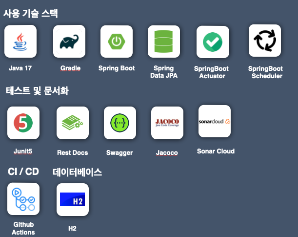

# 🏓 탁구 게임 서비스

---

## ⚠️  **프로그램 작동 안내**

```text
- 해당 탁구 게임은 맨 하단의 5가지 작동 시나리오를 거쳐, 프로그램이 작동되도록 구현되었습니다.
- 해당 프로그램은 먼저 헬스 체크를 통해 서버의 상태를 체크하고, 
  외부 API를 파싱하여 프로그램 작동에 필요한 데이터를 가져와 필요 부분을 저장한 후,
  프로그램의 요구사항 및 각 API의 요구사항과 시나리오를 거쳐 실행이 됩니다.
```

## 🏃🏻‍♂️개발 기간

---

#### **✏️ 프로그램 개발 : 1월 30일 ~ 2월 3일**

#### **🛠️ 리팩토링 및 예외 테스트 케이스 추가, RestDocs 문서화 및 Read.me 작성: 2월 9일 ~ 2월 19일**

## 🛠️ 사용 SW

---



## 🏢 아키텍처 구조

---

### 🎯 **메인 프로젝트**

```
├── common 패키지
│    └── ApiResponse.class
│    └── ApiResponseCode.enum
│    └── AutoCloseScheduledExecutor.class
│    └── BusinessException.class
│    └── GlobalExceptionHandler.class
│    └── InvalidEnumArgumentException.class
│    └── ResponseCode.interface
│
├── config 패키지
│    └── AppConfig.class
│    └── DatabaseConnectionCheckConfiguration.class
│    └── PageableValidationInterceptor.class
│    └── SwaggerConfig.class
│    └── WebMvcConfig.class
│
├── controller 패키지
│    └── InitializationController.class
│    └── RoomController.class
│    └── ServerStatusController.class
│    └── TeamController.class
│    └── UserController.class
│
├── domain 패키지
│    └── Room.class
│    └── User.class
│    └── UserRoom.class
│    └── enums 패키지
│          └── RoomStatus.enum
│          └── RoomType.enum
│          └── TeamStatus.enum
│          └── UserStatus.enum
│
├── dto 패키지
│    └── request 패키지
│          └── AttentionUserRequest.class
│          └── ChangeTeamRequest.class
│          └── CreateRoomRequest.class
│          └── ExitRoomRequest.class
│          └── InitializationRequest.class
│          └── StartGameRequest.class
│
│    └── response 패키지
│          └── RoomDetailResponse.class
│          └── RoomListResponse.class
│          └── RoomResponse.class
│          └── UserListResponse.class
│          └── UserResponse.class
│
├── repository 패키지
│    └── RoomRepository.Interface
│    └── UserRepository.Interface
│    └── UserRoomRepository.Interface
│
├── service 패키지
│     └── InitializationService.class
│     └── RoomService.class
│     └── ServerStatusService.class
│     └── TeamService.class
│     └── UserService.class
│
│     └── validation 패키지
│          └── ValidateInitService.class
│          └── ValidateRoomService.class
│          └── ValidateServerStatusService.class
│          └── ValidateTeamService.class
│ 
└──  PingPongApplication
```

### 🔎 **테스트**

- **124개의 테스트 케이스 작성(단위 테스트, 통합 테스트)**
- jacoco 기준: **89% 테스트 커버리지**
- SonarCloud 기준: **Zero Bugs, Zero Vulnerabilities, Zero Code Smells, Zero Security Hotspots**

```
├── controller 패키지
│    └── InitializationControllerTest.class
│    └── RoomAttentionControllerTest.class
│    └── RoomCreateControllerTest.class
│    └── RoomExitControllerTest.class
│    └── RoomFindAllControllerTest.class
│    └── RoomFindDetailControllerTest.class
│    └── RoomStartGameControllerTest.class
│    └── ServerStatusControllerTest.class
│    └── TeamControllerTest.class
│    └── UserControllerTest.class
│
├── domain 패키지
│    └── RoomTest.class
│    └── UserRoomTest.class
│    └── UserTest.class
│
├── fixture 패키지
│    └── domain 패키지
│          └── RoomFixture.class
│          └── UserFixture.class
│          └── UserRoomFixture.class
│
│    └── dto 패키지
│          └── RoomDtoFixture.class
│          └── UserDtoFixture.class
│  
│    └── setup 패키지
│          └── RoomSetup.class
│          └── UserRoomSetup.class
│          └── UserSetup.class
│
├── repository 패키지
│          └── RoomRepositoryTest.class
│          └── UserRepositoryTest.class
│          └── UserRoomRepositoryTest.class
│ 
├── service 패키지
│          └── InitializationServiceTest.class
│          └── RoomAttentionService.class
│          └── RoomCreateServiceTest.class
│          └── RoomExitService.class
│          └── RoomFindAllServiceTest.class
│          └── RoomFindDetailService.class
│          └── RoomFindDetailService.class
│          └── RoomGameStartService.class
│          └── ServerStatusServiceTest.class
│          └── TeamServiceTest.class
│          └── UserServiceTest.class
│
└──  ApplicationTests
```

## 🗣️ 프로그램 안내

---

1. 해당 서비스의 탁구 게임에는 2가지 타입이 존재합니다.

- **1) 단식(`SINGLE`) : 1대 1로 진행되는 탁구 게임**
- **2) 복식(`DOUBLE`) : 2대 2로 진행되는 탁구 게임**


2. 유저들은 방을 생성하거나 만들어진 방에 참가해 게임을 진행할 수 있습니다.

- **1) 방을 생성할 때, 방의 타입(`단식`, `복식`)을 선택하여 게임을 생성할 수 있습니다.**
- **2) 방을 생성한 유저는 해당 방의 `호스트`가 됩니다.**
- **3) 방은 대기(`WAIT`), 진행중(`PROGRESS`), 완료(`FINISH`) 상태를 가집니다.**
- **4) 방은 대기(`WAIT`) 상태일 때만 참가가 가능합니다.**
- **5) 게임이 시작되면, 방의 상태는 진행중(`PROGRESS`)으로 변경됩니다.**
    - 게임은 1분뒤 자동으로 종료됩니다.
- **6) 게임이 종료되면 방의 상태는 완료(`FINISH`)로 변경됩니다.**
    - **유저는 방이 대기(`WAIT`)상태일 때만 참가한 방에서 나갈 수 있습니다.**
- **7) 유저는 외부 API를 통해 파싱해서 가져온 fakerId에 따라 상태 달라집니다.**
    - 유저의 상태는 대기(`WAIT`), 활성(`ACTIVE`), 비활성(`NON_ACTIVE`)가 있습니다.
    - 유저의 상태가 활성(`ACTIVE`)일 때만 방을 생성, 게임 참가가 가능합니다.


3. 방에 참가한 유저들은 **`RED`, `BLUE`** 팀 중 한 개의 팀에 배정받습니다.

- **1) 유저는 하나의 방에만 참가할 수 있습니다.**
- **2) 해당 방을 생성하고 나서, 우선적으로 유저는 `RED팀`에 배정됩니다.**
- **3) 해당 방의 타입에 따라 인원이 절반 이상 일 때, `BLUE`팀에 배정됩니다.**
    - **게임이 시작되기 전에는 팀 변경이 가능합니다.**
    - **게임이 진행중이거나, 종료되면 팀 변경이 불가능합니다.**


4. 방 생성자(`호스트`)가 방을 나가게 되면, 해당 방에 있는 모든 사람도 방에 나가게 됩니다.
    - 해당 방은 완료(`FINISH`) 상태로 변경됩니다.
    - 해당 방에 참가한 호스트가 아닌 일반 유저가 방을 나가면, 해당 방의 상태는 변경되지 않습니다.


5. 데이터베이스는 H2 DB를 사용합니다.
6. JPA를 사용하며, ddl-auto 속성은 `create`로 설정합니다.
7. 공통 API Response를 사용하여 응답합니다.
    - 요청이 성공했을 때, `code = 200, message = "API 요청이 성공했습니다."`를 반환합니다.
    - 잘못된 API 요청은 `code = 201, message = "불가능한 요청입니다."` 를 반환합니다.
    - 그 외 서버 에러가 발생하는 케이스는 `code = 500, message = "에러가 발생했습니다."` 를 반환합니다.

```java
public class ApiResponse<T> {
    private Integer code;
    private String message;
    private T result;
}
```

<br/>
8. 해당 탁구 서비스에 사용되는 데이터 Model은 다음과 같습니다.

### **User**

| Field      | Type     | Description                                  |
|------------|----------|----------------------------------------------|
| id         | integer  | 유저 id 필드                                     |
| fakerId    | integer  | 외부 fakerAPI의 id 필드                           |
| name       | string   | 외부 fakerAPI의 username 필드                     |
| email      | string   | 외부 fakerAPI의 email 필드                        |
| status     | string   | 유저 상태: WAIT(대기), ACTIVE(활성), NON_ACTIVE(비활성) |
| created_at | datetime | 유저 생성 일자 (외부 fakerAPI를 통해 받아온 데이터가 저장되는 시점)  |
| updated_at | datetime | 유저 수정 일자 (외부 fakerAPI를 통해 받아온 데이터가 저장되는 시점)  |

### **Room**

| Field      | Type     | Description                                |
|------------|----------|--------------------------------------------|
| id         | integer  | 방의 id 필드                                   |
| title      | string   | 방 제목 필드                                    |
| host       | integer  | User.id  (호스트 id 필드)                       |
| room_type  | string   | 방 타입:  SINGLE(단식), DOUBLE(복식)              |
| status     | string   | 방 상태:  WAIT(대기), PROGRESS(진행중), FINISH(완료) |
| created_at | datetime | 방 생성일자                                     |
| updated_at | datetime | 방 수정일자                                     |

### **UserRoom**

- 유저와 방의 관계를 나타내는 테이블입니다.

| Field   | Type    | Description     |
|---------|---------|-----------------|
| id      | integer | UserRoom의 Id 필드 |
| room_id | integer | 방의 Id필드         |
| user_id | integer | 유저의 Id필드        |
| team    | string  | 팀 상태: RED, BLUE |

## ✏️ API 설명

---

### 1️⃣ 헬스체크 API

- 프로그램의 서버 상태를 체크하는 API입니다.
- 모든 시나리오에 대해 최초 1회 호출됩니다.

**API 경로**

``` Http
GET /health
```

<br/>

#### 🔎 구현 내용

1. Spring Actuator를 사용하여, 서버의 상태를 체크하는 API를 구현하였습니다.
2. 서버의 상태 뿐만 아닌, DB 연결 상태도 체크하도록 구현하였습니다.
3. Rest Docs를 이용하여, 서버 상태 정상 케이스, 서버 상태 비정상 케이스에 대한 문서화를 작성하였습니다.

<br/>

### 2️⃣ 초기화 API

- 기존에 있던 모든 유저 정보 및 방 정보를 삭제합니다.
- 이후, body로 전달 받은 seed와 quantity를 통해 fakerAPI를 호출하여, 해당 서비스에 필요한 유저 정보를 가져와 저장합니다.

**fakerAPI 경로**

```Http
https://fakerapi.it/api/v1/users?_seed={seed}&_quantity={quantity}&_locale=ko_KR
```

**fakerAPI 응답 결과에 따른 데이터 세팅**

1. 응답 값의 id 필드 = `fakerId`로 저장합니다.
2. 응답 값의 id 필드(`fakerId`)를 오름차순으로 정렬하여, 유저 정보를 저장합니다.
3. username 필드는 `name` 필드로 저장합니다.
4. email 필드는 그대로 `email` 필드로 저장합니다.
5. 유저 데이터가 저장되는 시점에 따라 `createdAt`과 `updatedAt`을 저장합니다.

⚠️ 제한 조건

- fakerAPI의 uuid, firstname, lastname, password, ip, macAddress, website, image 필드는 사용하지 않습니다.

**fakerAPI의 id 필드 값에 따른 회원 상태(status) 설정**

- fakerAPI의 id 필드 값에 따른 회원 상태는 다음 규칙에 따라 저장됩니다.

```text
1. 응답 값의 id(fakerId) 값 ≤ 30 (30이하)
- 회원 상태 = 활성상태(ACTIVATE) 상태로 세팅합니다.

2.  31(31 이상) ≤ 응답 값의 id(fakerId) 값 ≤ 60(60 이하)
- 회원 상태 = 대기(WAIT) 상태로 세팅합니다.

3. 61(61 이상)≤ 응답 값의 id(fakerId) 값
- 회원 상태 = 비활성(NON_ACTIVATE) 상태로 세팅합니다.
```

**API 경로**

```HTTP
POST /health
```

**요청 Body**

- seed: 난수
- quantity: 생성할 가짜 데이터 수

``` json
{
   "seed" : int,
   "quantity" : int,
}
```

<br/>

#### 🔎 구현 내용

1. 초기화 요청이 들어오면, 먼저 입력 값에 대한 유효성 검사를 수행하도록 구현하였습니다.
2. 입력 값에 대한 유효성 검사를 통과하면, 기존의 모든 유저 정보와 방의 정보를 삭제하며, fakerApI를 호출하여, 데이터를 가져와 저장하도록 구현하였습니다.
3. Rest Docs를 이용하여 초기화 요청 정상 케이스, 초기화 요청 비정상 케이스 등의 모든 응답 상황에 대한 문서화를 작성하였습니다.

<br/>

### 3️⃣ 유저 전체 조회 API

- 프로그램의 모든 유저 정보를 조회하는 API입니다.
- 유저의 `id`를 기준으로 오름차순으로 정렬하여 반환합니다.
- 페이징 처리를 위한 `size`와 `page`를 요청 파라미터로 받아 처리합니다.
- 응답 시 반환하는 `totalElements`는 모든 페이지에 존재하는 유저의 총 수를 의미합니다.
- 응답 시 반환하는 `totalPages`는 페이지로 제공되는 총 페이지 수를 의미하며, 찾은 유저의 총 수를 `size`로 나눈 값입니다.

API 경로

```HTTP
GET /user?size={size}&page={page}
```

**요청 파라미터**

| 파라미터 | 타입  | 설명     | 제약 사항 |
|------|-----|--------|-------|
| size | int | 요청 사이즈 | 필수    |
| page | int | 요청 페이지 | 필수    |

**응답 Body**

``` json
{
  "code" : 200,
  "message" : "API 요청이 성공했습니다.",
  "result" : {
    "totalElements" : int,
    "totalPages" : int,
    "userList" : [
      {
        "id" : int,
        "fakerId" : int,
        "name" : string,
        "email" : string,
        "status" : string, // WAIT(대기), ACTIVE(활성), NON_ACTIVE(비활성)
        "createdAt" : string, // yyyy-MM-dd HH:mm:ss 형태로 반환합니다.
        "updatedAt" : string // yyyy-MM-dd HH:mm:ss 형태로 반환합니다.
      }, ...
    ]
  }
}

```

<br/>

#### 🔎 구현 내용

1. 인터셉터를 이용하여, 요청 파라미터에 대한 유효성 검사를 수행하도록 구현하였습니다.
2. 요청 파라미터에 대한 유효성 검사를 통과하면, 모든 유저 정보를 조회하여 응답하도록 구현하였습니다.
3. Rest Docs를 이용하여 유저 전체 조회 요청 정상 케이스, 유저 전체 조회 요청 비정상 케이스 등의 모든 응답 상황에 대한 문서화를 작성하였습니다.

<br/>

### 4️⃣ 방 생성 API

- 유저가 방을 생성하는 API입니다.
- userId,roomType, title을 요청 파라미터로 받아 처리합니다.
- 방 생성 시, 해당 방의 상태는 대기(`WAIT`) 상태로 저장됩니다.
- 방을 생성한 유저는 해당 방의 호스트가 됩니다.
- 방이 저장되는 시점에 따라 `createdAt`과 `updatedAt`을 저장합니다.

⚠️ 제한 조건

1. 유저의 상태가 활성(`ACTIVE`)일 때만 방을 생성할 수 있습니다.
    - 유저의 상태가 활성(`ACTIVE`)이 아니면, 잘못된 요청으로 처리합니다.
2. 방을 생성하려고 하는 유저가 현재 다른 방에 참가 중이면, 방을 생성할 수 없습니다.
    - 유저가 참여하고 있는 방이 있을 때, 잘못된 요청으로 처리합니다.

**API 경로**

```HTTP
POST /room
```

**요청 Body**

| 필드       | 타입     | 설명    | 제약 사항 |
|----------|--------|-------|-------|
| userId   | int    | 유저 id | 필수    |
| roomType | String | 방 상태  | 필수    |
| title    | String | 방 제목  | 필수    |

<br/>

#### 🔎 구현 내용

1. 요청 Body에 대한 유효성 검사를 수행하도록 구현하였습니다.
2. 요청 시 방 타입이 한글, 영문 모두 가능하도록 구현하였습니다.
    - 한글: 단식, 복식
    - 영문: SINGLE, DOUBLE
3. 방을 생성하려는 유저가 존재하는지, 그리고 그 유저의 상태가 활성(ACTIVE)인지 확인하도록 구현하였습니다.
4. 유저가 이미 다른 방에 참여하고 있는지 확인하며, 만약 참여하고 있다면, 새로운 방을 생성하지 못하도록 구현하였습니다.
5. Rest Docs를 이용하여 방 생성 요청 정상 케이스, 방 생성 요청 비정상 케이스 등의 모든 응답 상황에 대한 문서화를 작성하였습니다.

### 5️⃣ 방 전체 조회 API

- 프로그램의 모든 방 정보를 조회하는 API입니다.
- 방의 `id`를 기준으로 오름차순으로 정렬하여 반환합니다.
- 페이징 처리를 위한 `size`와 `page`를 요청 파라미터로 받아 처리합니다.
- 응답 시 반환하는 `totalElements`는 모든 페이지에 존재하는 방의 총 수를 의미합니다.
- 응답 시 반환하는 `totalPages`는 페이지로 제공되는 총 페이지 수를 의미하며, 찾은 방의 총 수를 `size`로 나눈 값입니다.

**API 경로**

```HTTP
GET /room?size={size}&page={page}
```

**요청 파라미터**

| 파라미터 | 타입  | 설명     | 제약 사항 |
|------|-----|--------|-------|
| size | int | 요청 사이즈 | 필수    |
| page | int | 요청 페이지 | 필수    |

**응답 Body**

``` json
{
  "code" : 200,
  "message" : "API 요청이 성공했습니다.",
  "result" : {
		"totelElements" : int,
		"totalPages" : int,
		"roomList" : [
			{
				"id" : int,
				"title" : string,
				"hostId" : int,
				"roomType" : string, // SINGLE(단식), DOUBLE(복식)
				"status" : string, // WAIT(대기), PROGRESS(진행중), FINISH(완료)
			}, ...
		]
	}
}
```
<br/>

#### 🔎 구현 내용

1. 인터셉터를 이용하여, 요청 파라미터에 대한 유효성 검사를 수행하도록 구현하였습니다.
2. 요청 파라미터에 대한 유효성 검사를 통과하면, 모든 방 정보를 조회하여 응답하도록 구현하였습니다.
3. Rest Docs를 이용하여 방 전체 조회 요청 정상 케이스, 방 전체 조회 요청 비정상 케이스 등의 모든 응답 상황에 대한 문서화를 작성하였습니다.
<br/>

### 6️⃣ 방 상세 조회 API

- 프로그램의 특정 방의 상세 정보를 조회하는 API입니다.
- 방의 `id`를 요청 파라미터로 받아 처리합니다.
- 해당 방의 `createdAt`, `updatedAt`을 포함한 모든 정보를 반환합니다.

**API 경로**

```HTTP
GET /room/{roomId}
```

**응답 Body**

``` json
{
  "code" : 200,
  "message" : "API 요청이 성공했습니다.",
  "result" : {
		"id" : int,
		"title" : string,
		"hostId" : int,
		"roomType" : string, // SINGLE(단식), DOUBLE(복식)
		"status" : string, // WAIT(대기), PROGRESS(진행중), FINISH(완료)
		"createdAt" : string, // yyyy-MM-dd HH:mm:ss 형태로 반환합니다.
		"updatedAt" : string // yyyy-MM-dd HH:mm:ss 형태로 반환합니다.
	}
}
```
<br/>

#### 🔎 구현 내용

1. 해당 방의 id에 대한 유효성 검사를 수행하도록 구현하였습니다.
2. 요청 파라미터에 대한 유효성 검사를 통과하면, 해당 방의 상세 정보를 조회하여 응답하도록 구현하였습니다.
3. Rest Docs를 이용하여 방 상세 조회 요청 정상 케이스, 방 상세 조회 요청 비정상 케이스 등의 모든 응답 상황에 대한 문서화를 작성하였습니다.

<br/>

### 7️⃣ 방 참가 API

- 유저가 생성된 방에 참가하는 API입니다.

⚠️ 제한 조건

1. 참가하려는 방의 상태가 대기(`WAIT`) 상태일 때만 참가할 수 있습니다.
    - 방의 상태가 대기(`WAIT`) 상태가 아니면, 잘못된 요청으로 처리합니다.
2. 유저의 상태가 활성(`ACTIVE`)일 때만 방에 참가할 수 있습니다.
    - 유저의 상태가 활성(`ACTIVE`)이 아니면, 잘못된 요청으로 처리합니다.
3. 유저가 이미 다른 방에 참가 중이면, 방에 참가할 수 없습니다.
    - 유저가 참여하고 있는 방이 있을 때, 잘못된 요청으로 처리합니다.
4. 참가하고자 하는 방의 정원이 미달인 경우에만, 참가할 수 있습니다.
    - 참가하고자 하는 방의 정원이 가득찼다면, 잘못된 요청으로 처리합니다.
5. 존재하지 않는 방에 참가하려고 하는 경우, 잘못된 요청으로 처리합니다.

**API 경로**

```HTTP
POST /room/attention/{roomId}
```

**요청 Body**

``` json
{
   "userId" : int
}
```

<br/>

#### 🔎 구현 내용

1. 요청 Body에 대한 유효성 검사를 수행하도록 구현하였습니다.
2. 요청 Body에 대한 유효성 검사를 통과하면, 방의 상태, 유저의 상태, 방의 정원 등에 대한 여러 조건을 검사하여, 방에 참가하도록 구현하였습니다.
3. Rest Docs를 이용하여 방 참가 요청 정상 케이스, 방 참가 요청 비정상 케이스 등의 모든 응답 상황에 대한 문서화를 작성하였습니다.

<br/>

### 8️⃣ 방 나가기 API

- 유저가 방에서 나가는 API입니다.

⚠️ 제한 조건

1. 유저가 해당 방에 참가 중이어야만 나갈 수 있습니다.
    - 유저가 해당 방에 참가 중이 아니면, 잘못된 요청으로 처리합니다.
2. 방의 상태가 대기(`WAIT`) 상태일 때만 나갈 수 있습니다.
    - 방의 상태가 대기(`WAIT`) 상태가 아닌 시작(`PROGRESS`), 완료(`FINISH`) 상태일 때, 잘못된 요청으로 처리합니다.
3. 존재하지 않는 방에서 나가려고 하는 경우, 잘못된 요청으로 처리합니다.
4. 호스트가 방을 나가게 되면, 해당 방에 있는 모든 사람도 방에 나가게 됩니다.
    - 해당 방은 완료(`FINISH`) 상태로 변경됩니다.

**API 경로**

``` json
POST /room/out/{roomId}
```

**요청 Body**

``` json
{
   "userId" : int
}
```

<br/>

#### 🔎 구현 내용

1. 요청 Body에 대한 유효성 검사를 수행하도록 구현하였습니다.
2. 요청 Body에 대한 유효성 검사를 통과하면, 방의 상태, 유저의 상태, 방의 호스트 여부 등에 대한 여러 조건을 검사하여, 방에서 나가도록 구현하였습니다.
3. Rest Docs를 이용하여 방 나가기 요청 정상 케이스, 방 나가기 요청 비정상 케이스 등의 모든 응답 상황에 대한 문서화를 작성하였습니다.

<br/>

### 9️⃣ 게임 시작 API

- 유저가 생성된 방에서 게임을 시작하는 API입니다.
- 게임이 시작되면, 해당 방의 상태가 진행 중(`PROGRESS`) 상태로 변경됩니다.
- 게임이 시작 후, 1분뒤 자동으로 종료됩니다.
- 게임이 종료되면 방의 상태는 완료(`FINISH`)로 변경됩니다.

⚠️ 제한 조건

1. 해당 방의 호스트인 유저만 게임을 시작할 수 있습니다.
    - 해당 방의 호스트가 아니면, 잘못된 요청으로 처리합니다.
2. 방의 정원이 방의 타입(`SINGLE`, `DOUBLE`)에 맞게 채워져야만 게임을 시작할 수 있습니다.
    - 방의 정원이 방의 타입에 맞게 채워져 있지 않으면, 잘못된 요청으로 처리합니다.
3. 방의 상태가 대기(`WAIT`) 상태일 때만 게임을 시작할 수 있습니다.
    - 방의 상태가 대기(`WAIT`) 상태가 아닌 시작(`PROGRESS`), 완료(`FINISH`) 상태일 때, 잘못된 요청으로 처리합니다.
4. 존재하지 않는 방에서 게임을 시작하려고 하는 경우, 잘못된 요청으로 처리합니다.
5. 방에 참가한 인원에 대한 팀 배정 로직은 다음과 같습니다.
    - 양쪽 팀에 모두 자리가 있는 경우, `RED`팀에 먼저 배정합니다.
    - 호스트가 방을 생성할 때는, "양쪽 팀에 모두 자리가 있는 경우"이기 때문에, `RED`팀에 먼저 배정됩니다.
    - 한쪽 팀에 인원이 모두 찬 경우, 반대 팀으로 배정합니다.

**API 경로**

``` HTTP
PUT /room/start/{roomId}
```

**요청 Body**

``` json
{
   "userId" : int
}
```

<br/>

#### 🔎 구현 내용

1. 요청 Body에 대한 유효성 검사를 수행하도록 구현하였습니다.
2. 요청 Body에 대한 유효성 검사를 통과하면, 방의 상태, 유저의 상태, 방의 호스트 여부 등에 대한 여러 조건을 검사하여, 게임을 시작하도록 구현하였습니다.
3. 게임이 시작되면, 해당 방의 상태가 진행 중(`PROGRESS`)으로 변경되도록 구현하였습니다.
4. SpringScheduler를 이용하여 AutoCloseScheduledExecutor에 스케줄링 작업을 등록하여, 게임이 시작 후, 1분뒤 자동으로 종료되도록 구현하였습니다.
5. 게임이 종료되면 방의 상태는 완료(`FINISH`)로 변경되도록 구현하였습니다.
6. Rest Docs를 이용하여 게임 시작 요청 정상 케이스, 게임 시작 요청 비정상 케이스 등의 모든 응답 상황에 대한 문서화를 작성하였습니다.

<br/>

### 🔟 팀 변경 API

- 유저가 참가한 방에서 팀을 변경하는 API입니다.

⚠️ 제한 조건

1. 유저가 방에 참가 중이어야만 팀을 변경할 수 있습니다.
    - 유저가 해당 방에 참가 중이 아니면, 잘못된 요청으로 처리합니다.
2. 방의 상태가 대기(`WAIT`) 상태일 때만 팀을 변경할 수 있습니다.
    - 방의 상태가 대기(`WAIT`) 상태가 아닌 시작(`PROGRESS`), 완료(`FINISH`) 상태일 때, 잘못된 요청으로 처리합니다.
3. 존재하지 않는 방에서 팀을 변경하려고 하는 경우, 잘못된 요청으로 처리합니다.
4. 유저가 현재 속한 팀 기준으로 반대 팀으로 변경됩니다.
    - 유저가 현재 속한 팀이 `RED`팀이면, `BLUE`팀으로 변경됩니다.
    - 유저가 현재 속한 팀이 `BLUE`팀이면, `RED`팀으로 변경됩니다.
5. 변경을 시도할 때, 반대 팀의 인원이 가득 차있으면, 변경할 수 없습니다.
    - 반대 팀의 인원이 가득 차있으면, 잘못된 요청으로 처리합니다.

**API 경로**

``` json
PUT /team/{roomId}
```

**요청 Body**

``` json
{
   "userId" : int
}
```

<br/>

#### 🔎 구현 내용

1. 요청 Body에 대한 유효성 검사를 수행하도록 구현하였습니다.
2. 요청 Body에 대한 유효성 검사를 통과하면, 방의 상태, 방 참가 여부, 방의 팀 상태 등에 대한 여러 조건을 검사하여, 팀을 변경하도록 구현하였습니다.
3. Rest Docs를 이용하여 팀 변경 요청 정상 케이스, 팀 변경 요청 비정상 케이스 등의 모든 응답 상황에 대한 문서화를 작성하였습니다.

<br/>


## 🎬 프로그램 작동 시나리오

---

**⚠️ 프로그램 작동 시나리오 주의 사항**
- 헬스 체크 API는 모든 프로그램의 작동 시나리오 시작에서 호출됩니다.

### 1️⃣ 1번 작동 시나리오 

---

### 1. 헬스체크 API 호출
> Request
```bash
curl 'http://localhost:8080/health' -i -X GET \
    -H 'Accept: application/json' -w "\n"
```

> Response
```json
{
  "code": 200,
  "message": "API 요청이 성공했습니다."
}

```

### 2. 유저 전체 조회

> Request
```bash
curl 'http://localhost:8080/user?page=0&size=10' -i -X GET \
    -H 'Content-Type: application/json;charset=UTF-8' -w "\n"
```

> Response
```json
{
  "code": 200,
  "message": "API 요청이 성공했습니다.",
  "result": {
    "totalElements": 0,
    "totalPages": 0,
    "userList": []
  }
}

```

### 3. 초기화

> Request
```bash
curl 'http://localhost:8080/init' -i -X POST \
    -H 'Content-Type: application/json;charset=UTF-8' \
    -d '{"seed":123,"quantity":10}' -w "\n"
```

> Response
```json
{
  "code": 200,
  "message": "API 요청이 성공했습니다."
}

```

### 4. 유저 전체 조회

> Request
>

```bash
curl 'http://localhost:8080/user?page=0&size=10' -i -X GET \
    -H 'Content-Type: application/json;charset=UTF-8' -w "\n"
```

> Response
```json
{
   "code": 200,
   "message": "API 요청이 성공했습니다.",
   "result": {
      "totalElements": 10,
      "totalPages": 1,
      "userList": [
         {
            "id": 1,
            "fakerId": 1,
            "name": "jungran.gwon",
            "email": "knam@yahoo.com",
            "status": "ACTIVE",
            "createdAt": "2024-01-14 02:22:45",
            "updatedAt": "2024-01-14 02:22:45"
         },
         {
            "id": 2,
            "fakerId": 2,
            "name": "myungho.lim",
            "email": "go.minji@hotmail.com",
            "status": "ACTIVE",
            "createdAt": "2024-01-14 02:22:45",
            "updatedAt": "2024-01-14 02:22:45"
         },
         ...
         {
            "id": 10,
            "fakerId": 10,
            "name": "kwak.jumyoung",
            "email": "jeon.doyoon@hotmail.com",
            "status": "ACTIVE",
            "createdAt": "2024-01-14 02:22:45",
            "updatedAt": "2024-01-14 02:22:45"
         }
      ]
   }
}
```
<br/>

### 2️⃣ 2번 작동 시나리오

---

### 1. 헬스체크 API 호출
> Request
```bash
curl 'http://localhost:8080/health' -i -X GET \
    -H 'Accept: application/json' -w "\n"
```

> Response
```json
{
  "code": 200,
  "message": "API 요청이 성공했습니다."
}
```

### 2. 유저 전체 조회

> Request
```bash
curl 'http://localhost:8080/user?page=0&size=10' -i -X GET \
    -H 'Content-Type: application/json;charset=UTF-8' -w "\n"
```

> Response
```json
{
  "code": 200,
  "message": "API 요청이 성공했습니다.",
  "result": {
    "totalElements": 0,
    "totalPages": 0,
    "userList": []
  }
}
```

### 3. 초기화

> Request
```bash
curl 'http://localhost:8080/init' -i -X POST \
    -H 'Content-Type: application/json;charset=UTF-8' \
    -d '{"seed":123,"quantity":10}' -w "\n"
```

> Response
```json
{
  "code": 200,
  "message": "API 요청이 성공했습니다."
}

```

### 4. 유저 전체 조회

> Request
```bash
curl 'http://localhost:8080/user?page=0&size=10' -i -X GET \
    -H 'Content-Type: application/json;charset=UTF-8' -w "\n"
```

> Response
```json
{
   "code": 200,
   "message": "API 요청이 성공했습니다.",
   "result": {
      "totalElements": 10,
      "totalPages": 1,
      "userList": [
         {
            "id": 1,
            "fakerId": 1,
            "name": "jungran.gwon",
            "email": "knam@yahoo.com",
            "status": "ACTIVE",
            "createdAt": "2024-01-14 02:22:45",
            "updatedAt": "2024-01-14 02:22:45"
         },
         {
            "id": 2,
            "fakerId": 2,
            "name": "myungho.lim",
            "email": "go.minji@hotmail.com",
            "status": "ACTIVE",
            "createdAt": "2024-01-14 02:22:45",
            "updatedAt": "2024-01-14 02:22:45"
         },
         ...
         {
            "id": 10,
            "fakerId": 10,
            "name": "kwak.jumyoung",
            "email": "jeon.doyoon@hotmail.com",
            "status": "ACTIVE",
            "createdAt": "2024-01-14 02:22:45",
            "updatedAt": "2024-01-14 02:22:45"
         }
      ]
   }
}
```

### 5. 방 전체 조회

> Request
```bash
curl 'http://localhost:8080/room?page=0&size=10' -i -X GET \
    -H 'Content-Type: application/json;charset=UTF-8' -w "\n"
```

> Response
``` json
{
    "code": 200,
    "message": "API 요청이 성공했습니다.",
    "result": {
        "totalElements": 0,
        "totalPages": 0,
        "roomList": []
    }
}
```


### 6. 방 생성

> Request
```bash
curl 'http://localhost:8080/room' -i -X POST \
    -H 'Content-Type: application/json;charset=UTF-8' \
    -d '{"userId":1,"roomType":"SINGLE","title":"첫번째 테스트 방"}' -w "\n"
```
```bash
curl 'http://localhost:8080/room' -i -X POST \
    -H 'Content-Type: application/json;charset=UTF-8' \
    -d '{"userId":2,"roomType":"DOUBLE","title":"두번째 테스트 방"}' -w "\n"
```

> Response
``` json
{
    "code": 200,
    "message": "API 요청이 성공했습니다."
}
```

### 7. 방 전체 조회

> Request
```bash
curl 'http://localhost:8080/room?page=0&size=10' -i -X GET \
    -H 'Content-Type: application/json;charset=UTF-8' -w "\n"
```

> Response
``` json
{
    "code": 200,
    "message": "API 요청이 성공했습니다.",
    "result": {
        "totalElements": 2,
        "totalPages": 1,
        "roomList": [
            {
                "id": 1,
                "title": "첫번째 테스트 방",
                "hostId": 1,
                "roomType": "SINGLE",
                "status": "WAIT"
            },
            {
                "id": 2,
                "title": "두번째 테스트 방",
                "hostId": 2,
                "roomType": "DOUBLE",
                "status": "WAIT"
            }
        ]
    }
}
```

### 8. 방 상세 조회

> Request
```bash
curl 'http://localhost:8080/room/1' -i -X GET \
    -H 'Content-Type: application/json;charset=UTF-8' -w "\n"
```

> Response
``` json
{
    "code": 200,
    "message": "API 요청이 성공했습니다.",
    "result": {
        "id": 1,
        "title": "첫번째 테스트 방",
        "hostId": 1,
        "roomType": "SINGLE",
        "roomStatus": "WAIT",
        "createdAt": "2024-02-19 16:18:17",
        "updatedAt": "2024-02-19 16:18:17"
    }
}
```

### 3️⃣ 3번 작동 시나리오

---

### 1. 헬스체크 API 호출
> Request
```bash
curl 'http://localhost:8080/health' -i -X GET \
    -H 'Accept: application/json' -w "\n"
```

> Response
```json
{
  "code": 200,
  "message": "API 요청이 성공했습니다."
}
```

### 2. 유저 전체 조회

> Request
```bash
curl 'http://localhost:8080/user?page=0&size=10' -i -X GET \
    -H 'Content-Type: application/json;charset=UTF-8' -w "\n"
```

> Response
```json
{
  "code": 200,
  "message": "API 요청이 성공했습니다.",
  "result": {
    "totalElements": 0,
    "totalPages": 0,
    "userList": []
  }
}
```

### 3. 초기화

> Request
```bash
curl 'http://localhost:8080/init' -i -X POST \
    -H 'Content-Type: application/json;charset=UTF-8' \
    -d '{"seed":123,"quantity":10}' -w "\n"
```

> Response
```json
{
  "code": 200,
  "message": "API 요청이 성공했습니다."
}

```

### 4. 유저 전체 조회

> Request
```bash
curl 'http://localhost:8080/user?page=0&size=10' -i -X GET \
    -H 'Content-Type: application/json;charset=UTF-8' -w "\n"
```

> Response
```json
{
   "code": 200,
   "message": "API 요청이 성공했습니다.",
   "result": {
      "totalElements": 10,
      "totalPages": 1,
      "userList": [
         {
            "id": 1,
            "fakerId": 1,
            "name": "jungran.gwon",
            "email": "knam@yahoo.com",
            "status": "ACTIVE",
            "createdAt": "2024-01-14 02:22:45",
            "updatedAt": "2024-01-14 02:22:45"
         },
         {
            "id": 2,
            "fakerId": 2,
            "name": "myungho.lim",
            "email": "go.minji@hotmail.com",
            "status": "ACTIVE",
            "createdAt": "2024-01-14 02:22:45",
            "updatedAt": "2024-01-14 02:22:45"
         },
         ...
         {
            "id": 10,
            "fakerId": 10,
            "name": "kwak.jumyoung",
            "email": "jeon.doyoon@hotmail.com",
            "status": "ACTIVE",
            "createdAt": "2024-01-14 02:22:45",
            "updatedAt": "2024-01-14 02:22:45"
         }
      ]
   }
}
```

### 5. 방 전체 조회

> Request
```bash
curl 'http://localhost:8080/room?page=0&size=10' -i -X GET \
    -H 'Content-Type: application/json;charset=UTF-8' -w "\n"
```

> Response
``` json
{
    "code": 200,
    "message": "API 요청이 성공했습니다.",
    "result": {
        "totalElements": 0,
        "totalPages": 0,
        "roomList": []
    }
}
```


### 6. 방 생성

> Request
```bash
curl 'http://localhost:8080/room' -i -X POST \
    -H 'Content-Type: application/json;charset=UTF-8' \
    -d '{"userId":1,"roomType":"SINGLE","title":"첫번째 테스트 방"}' -w "\n"
```

> Response
``` json
{
    "code": 200,
    "message": "API 요청이 성공했습니다."
}
```

### 7. 방 전체 조회

> Request
```bash
curl 'http://localhost:8080/room?page=0&size=10' -i -X GET \
    -H 'Content-Type: application/json;charset=UTF-8' -w "\n"
```

> Response
``` json
{
    "code": 200,
    "message": "API 요청이 성공했습니다.",
    "result": {
        "totalElements": 1,
        "totalPages": 1,
        "roomList": [
            {
                "id": 1,
                "title": "첫번째 테스트 방",
                "hostId": 1,
                "roomType": "SINGLE",
                "status": "WAIT"
            }
        ]
    }
}
```

### 8. 방 상세 조회

> Request
```bash
curl 'http://localhost:8080/room/1' -i -X GET \
    -H 'Content-Type: application/json;charset=UTF-8' -w "\n"
```

> Response
``` json
{
    "code": 200,
    "message": "API 요청이 성공했습니다.",
    "result": {
        "id": 1,
        "title": "첫번째 테스트 방",
        "hostId": 1,
        "roomType": "SINGLE",
        "roomStatus": "WAIT",
        "createdAt": "2024-02-19 16:32:01",
        "updatedAt": "2024-02-19 16:32:01"
    }
}
```

### 9. 방 참가

> Request
```bash
curl 'http://localhost:8080/room/attention/1' -i -X POST \
    -H 'Content-Type: application/json;charset=UTF-8' \
    -d '{"userId":2}' -w "\n"
```

> Response
``` json
{
    "code": 200,
    "message": "API 요청이 성공했습니다."
}
```

### 10. 방 참가
- 방의 인원을 초과해서 참가하는 경우, 잘못된 요청으로 처리합니다.

> Request
```bash
curl 'http://localhost:8080/room/attention/1' -i -X POST \
    -H 'Content-Type: application/json;charset=UTF-8' \
    -d '{"userId":3}' -w "\n"
```

> Response
``` json
{
    "code": 201,
    "message": "불가능한 요청입니다."
}
```

### 4️⃣ 4번 작동 시나리오

---

### 1. 헬스체크 API 호출
> Request
```bash
curl 'http://localhost:8080/health' -i -X GET \
    -H 'Accept: application/json' -w "\n"
```

> Response
```json
{
  "code": 200,
  "message": "API 요청이 성공했습니다."
}
```

### 2. 유저 전체 조회

> Request
```bash
curl 'http://localhost:8080/user?page=0&size=10' -i -X GET \
    -H 'Content-Type: application/json;charset=UTF-8' -w "\n"
```

> Response
```json
{
  "code": 200,
  "message": "API 요청이 성공했습니다.",
  "result": {
    "totalElements": 0,
    "totalPages": 0,
    "userList": []
  }
}
```

### 3. 초기화

> Request
```bash
curl 'http://localhost:8080/init' -i -X POST \
    -H 'Content-Type: application/json;charset=UTF-8' \
    -d '{"seed":123,"quantity":10}' -w "\n"
```

> Response
```json
{
  "code": 200,
  "message": "API 요청이 성공했습니다."
}

```

### 4. 유저 전체 조회

> Request
```bash
curl 'http://localhost:8080/user?page=0&size=10' -i -X GET \
    -H 'Content-Type: application/json;charset=UTF-8' -w "\n"
```

> Response
```json
{
   "code": 200,
   "message": "API 요청이 성공했습니다.",
   "result": {
      "totalElements": 10,
      "totalPages": 1,
      "userList": [
         {
            "id": 1,
            "fakerId": 1,
            "name": "jungran.gwon",
            "email": "knam@yahoo.com",
            "status": "ACTIVE",
            "createdAt": "2024-01-14 02:22:45",
            "updatedAt": "2024-01-14 02:22:45"
         },
         {
            "id": 2,
            "fakerId": 2,
            "name": "myungho.lim",
            "email": "go.minji@hotmail.com",
            "status": "ACTIVE",
            "createdAt": "2024-01-14 02:22:45",
            "updatedAt": "2024-01-14 02:22:45"
         },
         ...
         {
            "id": 10,
            "fakerId": 10,
            "name": "kwak.jumyoung",
            "email": "jeon.doyoon@hotmail.com",
            "status": "ACTIVE",
            "createdAt": "2024-01-14 02:22:45",
            "updatedAt": "2024-01-14 02:22:45"
         }
      ]
   }
}
```

### 5. 방 전체 조회

> Request
```bash
curl 'http://localhost:8080/room?page=0&size=10' -i -X GET \
    -H 'Content-Type: application/json;charset=UTF-8' -w "\n"
```

> Response
``` json
{
    "code": 200,
    "message": "API 요청이 성공했습니다.",
    "result": {
        "totalElements": 0,
        "totalPages": 0,
        "roomList": []
    }
}
```


### 6. 방 생성

> Request
```bash
curl 'http://localhost:8080/room' -i -X POST \
    -H 'Content-Type: application/json;charset=UTF-8' \
    -d '{"userId":1,"roomType":"DOUBLE","title":"첫번째 테스트 방"}' -w "\n"
```

> Response
``` json
{
    "code": 200,
    "message": "API 요청이 성공했습니다."
}
```

### 7. 방 전체 조회

> Request
```bash
curl 'http://localhost:8080/room?page=0&size=10' -i -X GET \
    -H 'Content-Type: application/json;charset=UTF-8' -w "\n"
```

> Response
``` json
{
    "code": 200,
    "message": "API 요청이 성공했습니다.",
    "result": {
        "totalElements": 1,
        "totalPages": 1,
        "roomList": [
            {
                "id": 1,
                "title": "첫번째 테스트 방",
                "hostId": 1,
                "roomType": "DOUBLE",
                "status": "WAIT"
            }
        ]
    }
}
```

### 8. 방 상세 조회

> Request
```bash
curl 'http://localhost:8080/room/1' -i -X GET \
    -H 'Content-Type: application/json;charset=UTF-8' -w "\n"
```

> Response
``` json
{
    "code": 200,
    "message": "API 요청이 성공했습니다.",
    "result": {
        "id": 1,
        "title": "첫번째 테스트 방",
        "hostId": 1,
        "roomType": "DOUBLE",
        "roomStatus": "WAIT",
        "createdAt": "2024-02-19 16:33:35",
        "updatedAt": "2024-02-19 16:33:35"
    }
}
```

### 9. 방 참가

> Request
```bash
curl 'http://localhost:8080/room/attention/1' -i -X POST \
    -H 'Content-Type: application/json;charset=UTF-8' \
    -d '{"userId":2}' -w "\n"
```
```bash
curl 'http://localhost:8080/room/attention/1' -i -X POST \
    -H 'Content-Type: application/json;charset=UTF-8' \
    -d '{"userId":3}' -w "\n"
```

> Response
``` json
{
    "code": 200,
    "message": "API 요청이 성공했습니다."
}
```
> Response
``` json
{
    "code": 200,
    "message": "API 요청이 성공했습니다."
}
```

### 10. 팀 변경

> Request
```bash
curl 'http://localhost:8080/team/1' -i -X PUT \
    -H 'Content-Type: application/json;charset=UTF-8' \
    -d '{"userId":2}' -w "\n"
```

> Response
``` json
{
    "code": 200,
    "message": "API 요청이 성공했습니다."
}
```

### 11. 방 참가

> Request
```bash
curl 'http://localhost:8080/room/attention/1' -i -X POST \
    -H 'Content-Type: application/json;charset=UTF-8' \
    -d '{"userId":4}' -w "\n"
```

> Response
``` json
{
    "code": 200,
    "message": "API 요청이 성공했습니다."
}
```

### 12. 게임 시작

- 게임 시작은 해당 방의 호스트만 시작 할 수 있습니다.
#### 호스트가 아닌 유저가 게임 시작을 요청하는 경우
> Request
```bash
curl 'http://localhost:8080/room/start/1' -i -X PUT \
    -H 'Content-Type: application/json;charset=UTF-8' \
    -d '{"userId":2}' -w "\n"
```

> Response
``` json
{
    "code": 201,
    "message": "불가능한 요청입니다."
}
```

#### 호스트가 게임 시작할 경우
> Request
```bash
curl 'http://localhost:8080/room/start/1' -i -X PUT \
    -H 'Content-Type: application/json;charset=UTF-8' \
    -d '{"userId":1}' -w "\n"
```

> Response
``` json
{
    "code": 200,
    "message": "API 요청이 성공했습니다."
}
```


### 5️⃣ 5번 작동 시나리오  


### 1. 헬스체크 API 호출
> Request
```bash
curl 'http://localhost:8080/health' -i -X GET \
    -H 'Accept: application/json' -w "\n"
```

> Response
```json
{
  "code": 200,
  "message": "API 요청이 성공했습니다."
}
```

### 2. 유저 전체 조회

> Request
```bash
curl 'http://localhost:8080/user?page=0&size=10' -i -X GET \
    -H 'Content-Type: application/json;charset=UTF-8' -w "\n"
```

> Response
```json
{
  "code": 200,
  "message": "API 요청이 성공했습니다.",
  "result": {
    "totalElements": 0,
    "totalPages": 0,
    "userList": []
  }
}
```

### 3. 초기화

> Request
```bash
curl 'http://localhost:8080/init' -i -X POST \
    -H 'Content-Type: application/json;charset=UTF-8' \
    -d '{"seed":123,"quantity":10}' -w "\n"
```

> Response
```json
{
  "code": 200,
  "message": "API 요청이 성공했습니다."
}

```

### 4. 유저 전체 조회

> Request
```bash
curl 'http://localhost:8080/user?page=0&size=10' -i -X GET \
    -H 'Content-Type: application/json;charset=UTF-8' -w "\n"
```

> Response
```json
{
   "code": 200,
   "message": "API 요청이 성공했습니다.",
   "result": {
      "totalElements": 10,
      "totalPages": 1,
      "userList": [
         {
            "id": 1,
            "fakerId": 1,
            "name": "jungran.gwon",
            "email": "knam@yahoo.com",
            "status": "ACTIVE",
            "createdAt": "2024-01-14 02:22:45",
            "updatedAt": "2024-01-14 02:22:45"
         },
         {
            "id": 2,
            "fakerId": 2,
            "name": "myungho.lim",
            "email": "go.minji@hotmail.com",
            "status": "ACTIVE",
            "createdAt": "2024-01-14 02:22:45",
            "updatedAt": "2024-01-14 02:22:45"
         },
         ...
         {
            "id": 10,
            "fakerId": 10,
            "name": "kwak.jumyoung",
            "email": "jeon.doyoon@hotmail.com",
            "status": "ACTIVE",
            "createdAt": "2024-01-14 02:22:45",
            "updatedAt": "2024-01-14 02:22:45"
         }
      ]
   }
}
```

### 5. 방 전체 조회

> Request
```bash
curl 'http://localhost:8080/room?page=0&size=10' -i -X GET \
    -H 'Content-Type: application/json;charset=UTF-8' -w "\n"
```

> Response
``` json
{
    "code": 200,
    "message": "API 요청이 성공했습니다.",
    "result": {
        "totalElements": 0,
        "totalPages": 0,
        "roomList": []
    }
}
```


### 6. 방 생성

> Request
```bash
curl 'http://localhost:8080/room' -i -X POST \
    -H 'Content-Type: application/json;charset=UTF-8' \
    -d '{"userId":1,"roomType":"SINGLE","title":"첫번째 테스트 방"}' -w "\n"
```

> Response
``` json
{
    "code": 200,
    "message": "API 요청이 성공했습니다."
}
```

### 7. 방 전체 조회

> Request
```bash
curl 'http://localhost:8080/room?page=0&size=10' -i -X GET \
    -H 'Content-Type: application/json;charset=UTF-8' -w "\n"
```

> Response
``` json
{
    "code": 200,
    "message": "API 요청이 성공했습니다.",
    "result": {
        "totalElements": 1,
        "totalPages": 1,
        "roomList": [
            {
                "id": 1,
                "title": "첫번째 테스트 방",
                "hostId": 1,
                "roomType": "DOUBLE",
                "status": "WAIT"
            }
        ]
    }
}
```

### 8. 방 상세 조회

> Request
```bash
curl 'http://localhost:8080/room/1' -i -X GET \
    -H 'Content-Type: application/json;charset=UTF-8' -w "\n"
```

> Response
``` json
{
    "code": 200,
    "message": "API 요청이 성공했습니다.",
    "result": {
        "id": 1,
        "title": "첫번째 테스트 방",
        "hostId": 1,
        "roomType": "DOUBLE",
        "roomStatus": "WAIT",
        "createdAt": "2024-02-19 16:33:35",
        "updatedAt": "2024-02-19 16:33:35"
    }
}
```

### 9. 방 참가

> Request
```bash
curl 'http://localhost:8080/room/attention/1' -i -X POST \
    -H 'Content-Type: application/json;charset=UTF-8' \
    -d '{"userId":2}' -w "\n"
```

> Response
``` json
{
    "code": 200,
    "message": "API 요청이 성공했습니다."
}
```

### 10. 방 나가기
- 일반 유저가 방을 나갈 경우
> Request
```bash
curl 'http://localhost:8080/room/out/1' -i -X POST \
    -H 'Content-Type: application/json;charset=UTF-8' \
    -d '{"userId":2}' -w "\n"
```

> Response
``` json
{
    "code": 200,
    "message": "API 요청이 성공했습니다."
}
```

### 11. 방 참가

> Request
```bash
curl 'http://localhost:8080/room/attention/1' -i -X POST \
    -H 'Content-Type: application/json;charset=UTF-8' \
    -d '{"userId":3}' -w "\n"
```

> Response
``` json
{
    "code": 200,
    "message": "API 요청이 성공했습니다."
}
```

### 12. 방 나가기
 
#### 호스트가 방을 나갈 경우
> Request
```bash
curl 'http://localhost:8080/room/out/1' -i -X POST \
    -H 'Content-Type: application/json;charset=UTF-8' \
    -d '{"userId":1}' -w "\n"
```

> Response
``` json
{
    "code": 200,
    "message": "API 요청이 성공했습니다."
}
```

#### 방 상세 조회
> Request
```bash
curl 'http://localhost:8080/room/1' -i -X GET \
    -H 'Content-Type: application/json;charset=UTF-8' -w "\n"
```

> Response
``` json
{
    "code": 200,
    "message": "API 요청이 성공했습니다.",
    "result": {
        "totalElements": 1,
        "totalPages": 1,
        "roomList": [
            {
                "id": 1,
                "title": "첫번째 테스트 방",
                "hostId": 1,
                "roomType": "SINGLE",
                "status": "FINISH"
            }
        ]
    }
}
```
